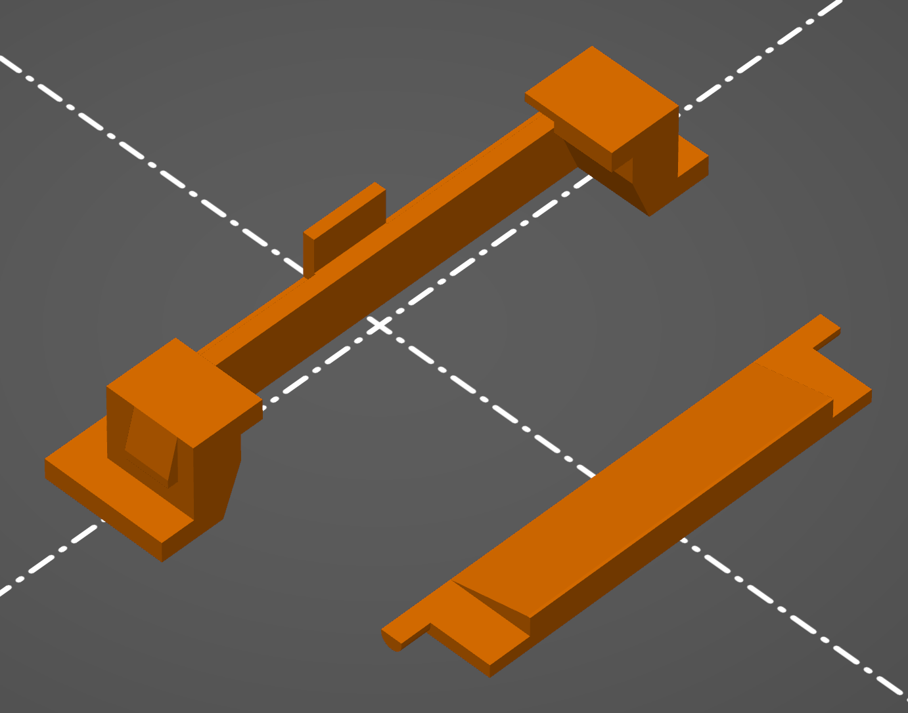
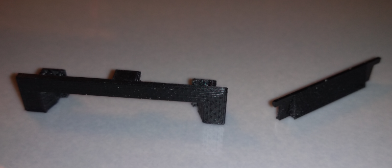
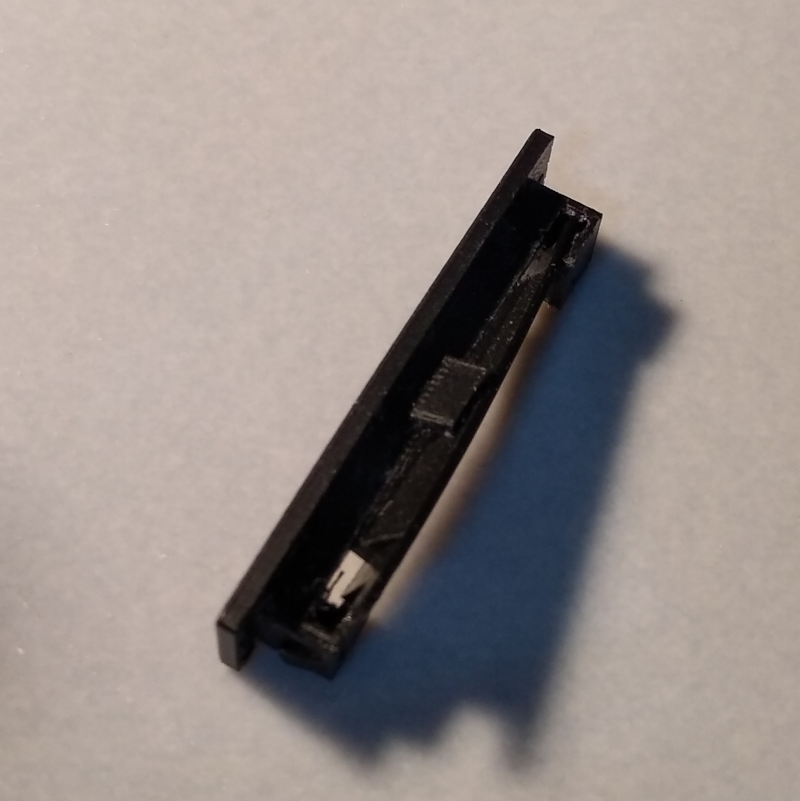
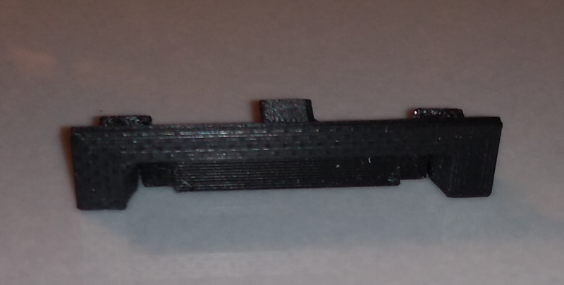

# Window Sash Weep Hole Cover

I needed replacemenmt weep hole covers for the 38 mm by 7 mm weep holes on the 
sash of my windows. So I designed a 3D printed replacement similar to the 
deteriorated original parts.

The parts consist of weep hole cover and a weep hole flap. The flap is
inserted into the cover from the top of the cover and the assembly is then 
inserted into the weep hole in the window sash.

# Assembly

Assembling the parts is a little tricky but the flap can be pushed into the 
cover from the top. It will require a little bit of bending to make it fit.

With the flap in place the part is ready to go into the weep hole on the 
window sash.

# Files

The STL files for the two parts are included and can be imported into your 
favorite slicer to generate the gcode for your 3D printer.

A pair of FCStd files are also included, these are the source FreeCAD files 
used to design the 3D models.
